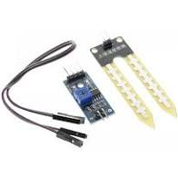

## Relatório referente à Macro Entrega 1 - 17/12/2020
> Responsável pela entrega: Osvaldo da Silva Neto

1. **Lista dos equipamentos:**

- ESP8266 nodemcu

- Sensor capacitivo de umidade do solo YL-69

- Sensor de temperatura DHT-11

  

2. **Descrição**

   2.1 - **ESP8266 nodemcu**

   

    
   
  

   ​         Este dispositivo será responsável por interme diar a comunicação entre os sensores e a aplicação web. Nele será feita toda a lógica de captura e processamento dos dados para posteriormente serem encaminhados para uma API que fará o tratamento e armazenamento dos dados em banco. A escolha deste módulo se deu por sua eficiência, baixo custo, por possuir uma interface de comunicação wifi integrada  além de pinos analógicos que simplificam a integração de todo o sistema evitando a aquisição e configuração de hardwares adicionais.

   

   2.2 - **Sensor** **capacitivo de umidade do solo YL-69**

   

      
   

   Este dispositivo será responsável pela leitura da umidade do solo, conectado ao módulo ESP8266

   2.3 - **Sensor DHT-11**

   

      
   

   ​Este sensor será responsável por capturar as variações de           temperatura e umidade do ambiente e será conectado ao módulo de transmissão ESP8266 para integração com o sistema.

​

3. **Estrutura do sistema**

      

4. **Códigos desenvolvidos para esta etapa**

* [Sensor de temperatura](https://github.com/motechnology/hardware/blob/main/sensor_temperatura_umidade_ambiente/sensor_temperatura_umidade_ambiente.ino)
* [Sensor de umidade do solo](https://github.com/motechnology/hardware/blob/main/sensor_umidade_solo/sensor_umidade_solo.ino)

5. **Resultados Da Macro Entrega 1**

  Macro Entrega 1 concluída (17/12/2020), porém percebemos que surgirá uma nova etapa para Entrega seguinte (Especificar o sistema de irrigação). Os testes  realizados foram todos em equipamentos eletrônicos. Troca da utilização do grafana por um aplicativo mobile.
  
  
## Relatório referente à Macro Entrega 2 - 25/02/2020
> Responsável pela entrega: Osvaldo da Silva Neto

1. **Alterações realizadas no projeto**
  Falar sobre: Mudanças no sensores
2. **Descrição do sistema de irrigação**
  Colocar algumas fotos do sistema de irrigação montado (bomba conectada na ESP e dentro de um reservatório ligada a um vaso)
3. **Funcionamento dos módulos de coleta (sensores)**
  Vídeo e breve descrição dos módulos coletando do vaso
  Colocar umas fotinhas de um vaso com sensores
4. **Resultados da Macro Entrega 2**
  Aqui será discutido com o professor
