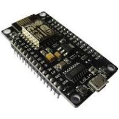
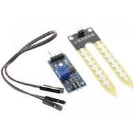
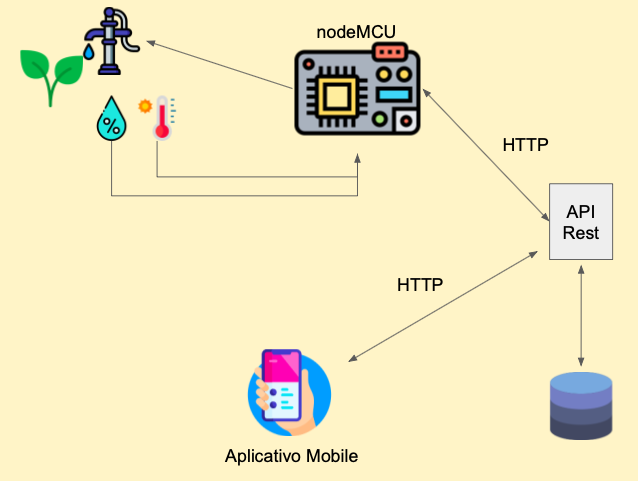
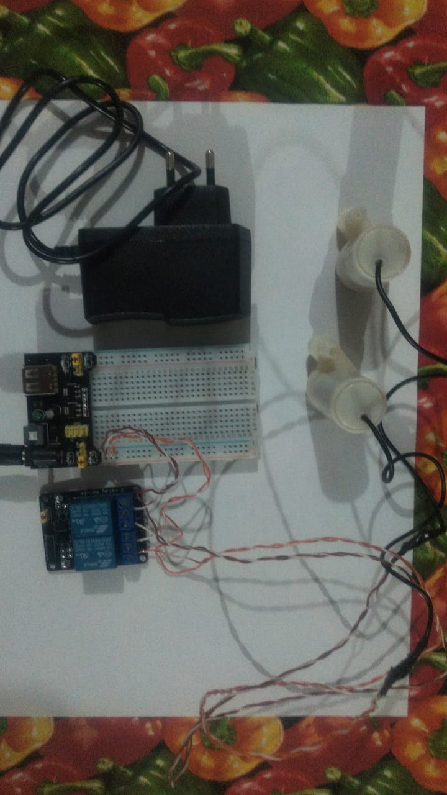
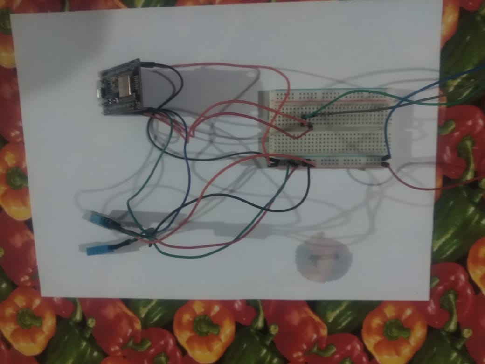

## Relatório referente à Macro Entrega 1 - 17/12/2020
> Responsável pela entrega: Osvaldo da Silva Neto

1. **Lista dos equipamentos:**

- ESP8266 nodemcu

- Sensor capacitivo de umidade do solo YL-69

- Sensor de temperatura DHT-11

  

2. **Descrição**

   2.1 - **ESP8266 nodemcu**

   

    
   
  

   ​         Este dispositivo será responsável por interme diar a comunicação entre os sensores e a aplicação web. Nele será feita toda a lógica de captura e processamento dos dados para posteriormente serem encaminhados para uma API que fará o tratamento e armazenamento dos dados em banco. A escolha deste módulo se deu por sua eficiência, baixo custo, por possuir uma interface de comunicação wifi integrada  além de pinos analógicos que simplificam a integração de todo o sistema evitando a aquisição e configuração de hardwares adicionais.

   

   2.2 - **Sensor** **capacitivo de umidade do solo YL-69**

   

      
   

   Este dispositivo será responsável pela leitura da umidade do solo, conectado ao módulo ESP8266

   2.3 - **Sensor DHT-11**

   

      
   

   ​Este sensor será responsável por capturar as variações de           temperatura e umidade do ambiente e será conectado ao módulo de transmissão ESP8266 para integração com o sistema.

​

3. **Estrutura do sistema**

      

4. **Códigos desenvolvidos para esta etapa**

* [Sensor de temperatura](https://github.com/motechnology/hardware/blob/main/sensor_temperatura_umidade_ambiente/sensor_temperatura_umidade_ambiente.ino)
* [Sensor de umidade do solo](https://github.com/motechnology/hardware/blob/main/sensor_umidade_solo/sensor_umidade_solo.ino)

5. **Resultados Da Macro Entrega 1**

  Macro Entrega 1 concluída (17/12/2020), porém percebemos que surgirá uma nova etapa para Entrega seguinte (Especificar o sistema de irrigação). Os testes  realizados foram todos em equipamentos eletrônicos. Troca da utilização do grafana por um aplicativo mobile.
  
  
## Relatório referente à Macro Entrega 2 - 25/02/2020
> Responsáveis pela entrega: Marcelo Bittencourt e Osvaldo da Silva Neto
> 
> Meta 2 e Meta 3

1. **Alterações realizadas no projeto**

Inicialmente o projeto visava utilizar dois tipos de sensores, um deles responsável pela captura da temperatura (DHT11) do ar e outro pela umidade do solo. Dessa forma, foi percebido que o sensor referente à umidade do solo realiza a captura dos dados de forma analógica, ou seja, precisamos conectar sua entra em uma porta analógica. Porém o nosso *hardware* central (ESP8266) possui somente uma entrada analógica, com isso a equipe optou por capturar a umidade do ar, a qual poderá ser realizada com a uitlização do mesmo sensor que captura a temperatura (DHT11) fazendo com que o custo do projeto reduza e ao mesmo tempo não afete o objetivo de funcionalidade do sistema.

2. **Descrição do sistema de irrigação**
 
Vamos utilizar uma Bomba D'água submersiva, a qual ficará dentro de um reservatório (jarro ou outro recipiente) e transportará a água ao vaso através de uma simples tubulação. A bomba terá sua alimentação diretamente ligada ao *hardware* central do sistema, em uma saída de 5V. A Figura abaixo demonstra como ficará essa parte do sistema.
 

      

      

  
3. **Funcionamento dos módulos de coleta (sensores)**

* [Vídeo Sistema de Irrigação](https://drive.google.com/file/d/1piNGlvtikLQNpZhYwwzxVAH2oyOLupsL/view?usp=sharing)

4. **Código desenvolvido para a captura dos dados**

* [Sensor de temperatura e umidade](https://github.com/motechnology/SIV-hardware/blob/main/LeituraUmidadeTemperatura/LeituraUmidadeTemperatura.ino)

5. **Funcionamento da REST API (utilizando software Postman)**

* [Vídeo REST API](https://drive.google.com/file/d/1m34eTSl2ZmOzTpDeFLiFrh-k4NlxYBYc/view?usp=sharing)

7. **Código desenvolvido para a API e armazenamento de dados**

* [REST API](https://github.com/motechnology/SIV-backend/blob/main/app.py)

8. **Resultados da Macro Entrega 2**
 
Entrega realizada com sucesso, sem nenhum ponto crítico. O professor sugeriu para utilizar pelo menos um dos sensores de umidade do solo, devido à limitação da ESP8266.

## Relatório referente à Macro Entrega 3 - 25/03/2021
> Responsável pela entrega: Marcelo Bittencourt
> 
> Meta 4

1. **Apresentação do Aplicativo Mobile**

* [App Mobile](https://github.com/motechnology/SIV-aplicativo)
* [Vídeo de apresentação](https://drive.google.com/file/d/1ujcM0sho8Tg6RrGgSQfa-QkuEcD5nVS_/view?usp=sharing)

2. **Resultados da Macro Entrega 3**  
Entrega realizada com sucesso, sem nenhum ponto crítico. Alguns pontos para futuras implementações: Faixa de temperatura, tempo de amostra escolhido pelo usuário, média dos valores captados.
