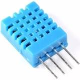
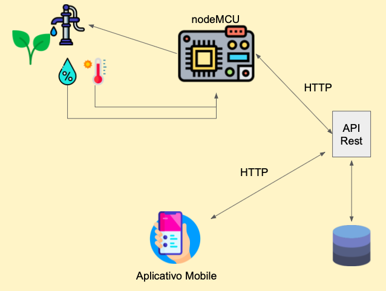
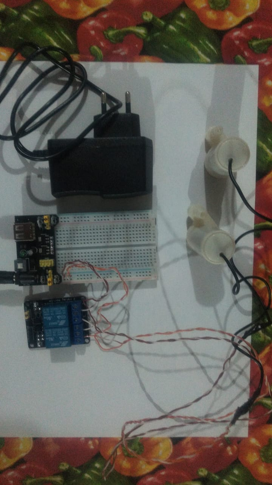
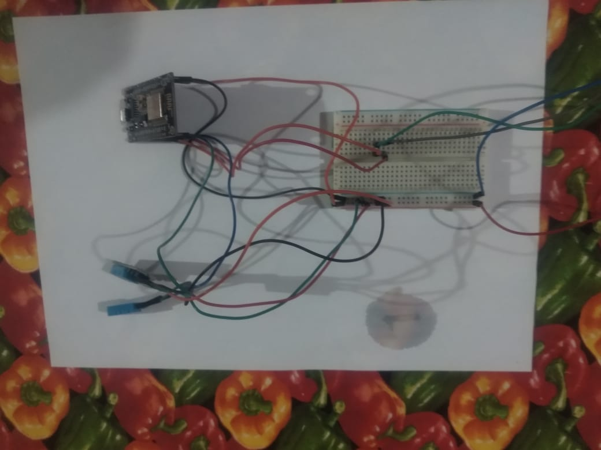
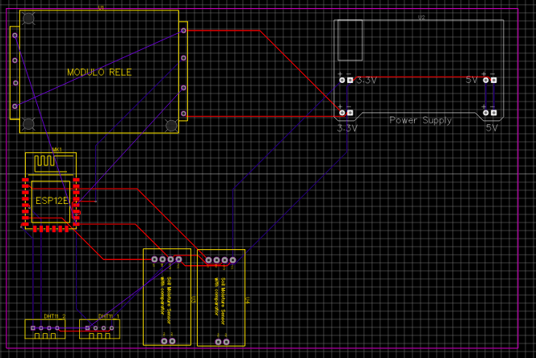
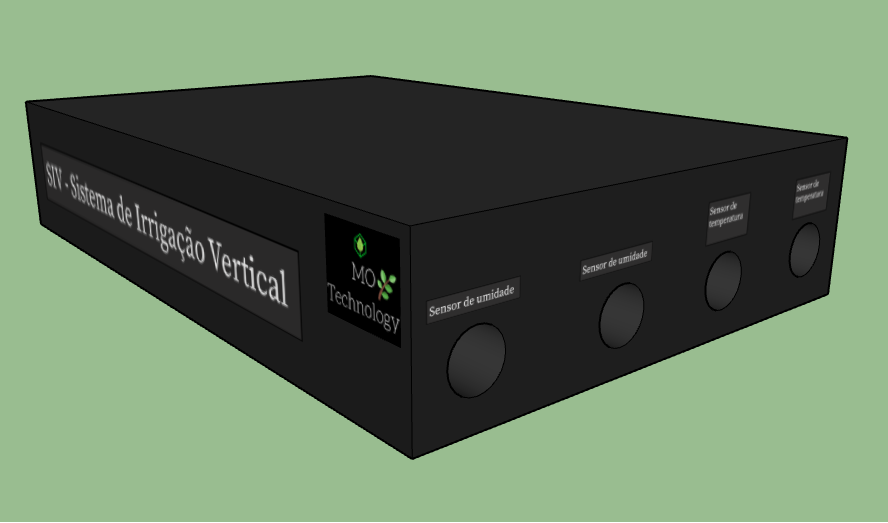
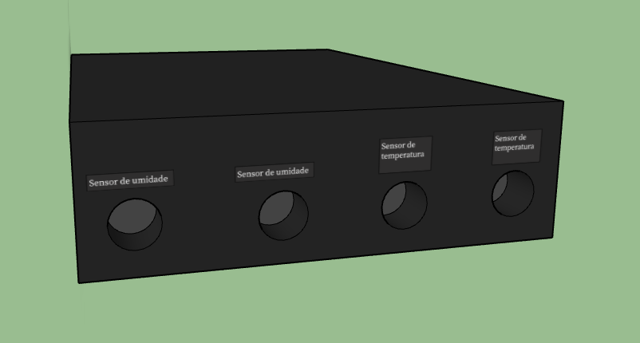
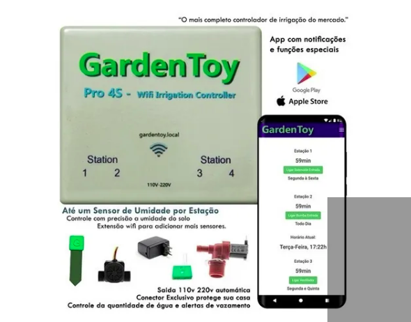
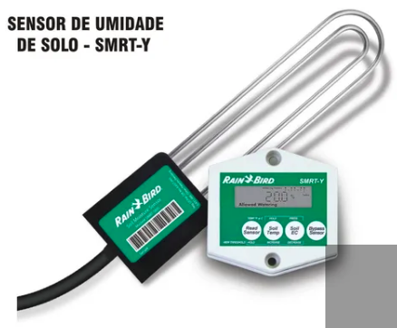
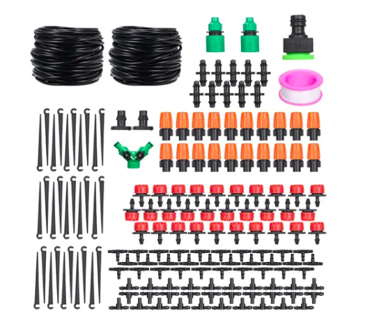

## Relatório referente à Macro Entrega 1 - 17/12/2020
> Responsável pela entrega: Osvaldo da Silva Neto

1. **Lista dos equipamentos:**

- ESP8266 nodemcu

- Sensor capacitivo de umidade do solo YL-69

- Sensor de temperatura DHT-11

  

2. **Descrição**

   2.1 - **ESP8266 nodemcu**

   

    
   
  

   ​         Este dispositivo será responsável por interme diar a comunicação entre os sensores e a aplicação web. Nele será feita toda a lógica de captura e processamento dos dados para posteriormente serem encaminhados para uma API que fará o tratamento e armazenamento dos dados em banco. A escolha deste módulo se deu por sua eficiência, baixo custo, por possuir uma interface de comunicação wifi integrada  além de pinos analógicos que simplificam a integração de todo o sistema evitando a aquisição e configuração de hardwares adicionais.

   

   2.2 - **Sensor** **capacitivo de umidade do solo YL-69**

   

      
   

   Este dispositivo será responsável pela leitura da umidade do solo, conectado ao módulo ESP8266

   2.3 - **Sensor DHT-11**

   

      
   

   ​Este sensor será responsável por capturar as variações de           temperatura e umidade do ambiente e será conectado ao módulo de transmissão ESP8266 para integração com o sistema.

3. **Estrutura do sistema**

      

4. **Códigos desenvolvidos para esta etapa**

* [Sensor de temperatura](https://github.com/motechnology/hardware/blob/main/sensor_temperatura_umidade_ambiente/sensor_temperatura_umidade_ambiente.ino)
* [Sensor de umidade do solo](https://github.com/motechnology/hardware/blob/main/sensor_umidade_solo/sensor_umidade_solo.ino)

5. **Resultados Da Macro Entrega 1**

  Macro Entrega 1 concluída (17/12/2020), porém percebemos que surgirá uma nova etapa para Entrega seguinte (Especificar o sistema de irrigação). Os testes  realizados foram todos em equipamentos eletrônicos. Troca da utilização do grafana por um aplicativo mobile.

## Relatório referente à Macro Entrega 2 - 25/02/2020
> Responsáveis pela entrega: Marcelo Bittencourt e Osvaldo da Silva Neto
> 
> Meta 2 e Meta 3

1. **Alterações realizadas no projeto**

Inicialmente o projeto visava utilizar dois tipos de sensores, um deles responsável pela captura da temperatura (DHT11) do ar e outro pela umidade do solo. Dessa forma, foi percebido que o sensor referente à umidade do solo realiza a captura dos dados de forma analógica, ou seja, precisamos conectar sua entra em uma porta analógica. Porém o nosso *hardware* central (ESP8266) possui somente uma entrada analógica, com isso a equipe optou por capturar a umidade do ar, a qual poderá ser realizada com a utilização do mesmo sensor que captura a temperatura (DHT11) fazendo com que o custo do projeto reduza e ao mesmo tempo não afete o objetivo de funcionalidade do sistema.

2. **Descrição do sistema de irrigação**

Vamos utilizar uma Bomba D'água submersiva, a qual ficará dentro de um reservatório (jarro ou outro recipiente) e transportará a água ao vaso através de uma simples tubulação. A bomba terá sua alimentação diretamente ligada ao *hardware* central do sistema, em uma saída de 5V. A Figura abaixo demonstra como ficará essa parte do sistema.

      

      

3. **Funcionamento dos módulos de coleta (sensores)**

* [Vídeo Sistema de Irrigação](https://drive.google.com/file/d/1piNGlvtikLQNpZhYwwzxVAH2oyOLupsL/view?usp=sharing)

4. **Código desenvolvido para a captura dos dados**

* [Sensor de temperatura e umidade](https://github.com/motechnology/SIV-hardware/blob/main/LeituraUmidadeTemperatura/LeituraUmidadeTemperatura.ino)

5. **Funcionamento da REST API (utilizando software Postman)**

* [Vídeo REST API](https://drive.google.com/file/d/1m34eTSl2ZmOzTpDeFLiFrh-k4NlxYBYc/view?usp=sharing)

7. **Código desenvolvido para a API e armazenamento de dados**

* [REST API](https://github.com/motechnology/SIV-backend/blob/main/app.py)

8. **Resultados da Macro Entrega 2**

Entrega realizada com sucesso, sem nenhum ponto crítico. O professor sugeriu  utilizar pelo menos um dos sensores de umidade do solo, devido à limitação da ESP8266.

## Relatório referente à Macro Entrega 3 - 25/03/2021
> Responsável pela entrega: Marcelo Bittencourt
> 
> Meta 4

1. **Apresentação do Aplicativo Mobile**

* [App Mobile](https://github.com/motechnology/SIV-aplicativo)
* [Vídeo de apresentação](https://drive.google.com/file/d/1ujcM0sho8Tg6RrGgSQfa-QkuEcD5nVS_/view?usp=sharing)

2. **Resultados da Macro Entrega 3**  
Entrega realizada com sucesso, sem nenhum ponto crítico. Alguns pontos para futuras implementações: Faixa de temperatura, tempo de amostra escolhido pelo usuário, média dos valores captados.

## Relatório referente à Macro Entrega 4 - 15/04/2021

> Responsável pela entrega: Jeneffer Farias Bora
>
> Meta 5

1.**Placa protótipo**

  Utilizando o software de *design* de placas EasyEDA  foi desenvolvida uma placa protótipo contendo o microcontrolador (ESP8266), os sensores de temperatura e demais módulos (regulador de tensão e relés). A figura abaixo exibe o diagrama esquemático da placa. 

https://github.com/motechnology/SIV-documentos/blob/main/macro-4/img/Schematic_Placa%20PJI3_2021-04-14%20(1).png

Esse digrama é convertido para uma PCB (placa de circutio impresso) como a figura a seguir exibe. Nesta figura podemos observar como ficariam dispostos os modulos, microcontrolore e os sensores na placa, caso ela fosse impressa.

 

Após impressão da placa, esta será colocada dentro de uma case para que os componente fiquem protegidos. Nessa case terão as saídas dos fios para conectar os sensores de umidade e temperatura, pois estes ficam dentro dos vasinhos a serem monitorados. A figura a seguir mostra o, também protótipo, da case. Esta é uma projeção do que seria o produto final entregue ao cliente. 

Na parte frontal da case é possível visualizar a saída dos fios dos sensores. 

2.**Levantamento de custos**

Para fazer a implementação do protótipo de placa, os custo são os descritos na tabela abaixo. Contudo, para nível de mercado também é necessário considerar os custos de produção da placa e mão de obra dos desenvolvedores.

| Item                                | Quantidade | Preço unitário(R$) | Total(R$) |
| ----------------------------------- | ---------- | ------------------ | --------- |
| NodeMCU - Esp32                     | 1          | 32,00              | 32,00     |
| Módulo Relé 5V 2 Canais             | 1          | 15,90              | 15,90     |
| Bomba d'água submersível 3-6V       | 2          | 17,90              | 35,80     |
| Sensor temperatura e umidade DHT 11 | 2          | 13,00              | 26,00     |
| Sensor de umidade do soloa YL-69    | 2          | 17,00              | 34,00     |
| Circuito impresso (placa)           | 1          | 8,20               | 8,20      |
| Fonte de alimentação 3.3V 5V        | 1          | 13,90              | 13,90     |
| Fonte DC Chaveada 9V 1A Plug P4     | 1          | 17,90              | 17,90     |
| Total:                              |            |                    | 183,70    |

3. **Estudo de mercado**

Considerando a situação de "novo normal" por conta da pandemia de coronavírus muitas pessoas passaram a ficar mais horas em casa e cultivar novos *hobbys*. Dentre esse *hobbys * percebeu-se um [tendência](https://g1.globo.com/jornal-nacional/noticia/2021/01/29/pandemia-faz-a-venda-de-plantas-e-flores-aumentar-em-todo-pais.ghtml) pelo cultivo de plantas e flores.  Sendo assim, decidiu-se por implementar um sistema que permitisse ao usuário ter uma cuidado com suas plantas de forma prática e eficiente.

Antes iniciar o projeto procuramos por outros produtos que pudessem exercer funções análogas aos quais o nosso se propunha. Ou seja, irrigar uma ou mais plantas, coletar de dados de leitura (umidade e temperatura) e acionamento as bombas de água de forma remota. Encontramos os seguintes concorrentes:

**GardenToy**

**Sensor de umidade de solo - SMRT-Y**

**Sistema Automático De Irrigação De Microgotejamento De Água**

| Produto                                                     | Alimentação Externa | Aplicativo Mobile | Controle de Umidade/Temperatura | Qtd. Válvulas | Controle de irrigação     | Preço (R$:) |
| ----------------------------------------------------------- | ------------------- | ----------------- | ------------------------------- | ------------- | ------------------------- | ----------- |
| SIV                                                         | Necessário          | Possui            | Possui                          | 2             | Possui                    | 184,00      |
| Sistema Automático De Irrigação De Microgotejamento De Água | Não necessita       | Não               | Não                             | 80            | Não possui                | 227,00      |
| GardenToy                                                   | Necessário          | Possui            | Apenas de umidade               | 4             | Possui                    | 799,00      |
| SMRT-Y                                                      | Não necessita       | Não possui        | Apenas de umidade               | N             | A depender do controlador | 2.282,68    |

Estes produtos executam funções análogas ao SIV porém a custos muito elevados no caso dos produtos que fazem algum tipo de automatização do sistema. 

No caso do produto Sistema Automático De Irrigação De Microgotejamento De Água , este se mostrou possuir uma eficiência de irrigação muito maior em termos de quantidade de válvulas para irrigação porém sem nenhum controle de umidade ou temperatura  e nem automatização da irrigação (é necessário ligar a torneira para irrigar).

O produto GardenToy é o produto que mais se assemelha ao nosso em termos de funcionalidades pois este faz leitura de umidade e automatização da irrigação (possível acionar a irrigação via aplicativo) porém possui um custo final muito elevado.

O produto SMRT-Y,  demanda da necessidade de  um controlador para poder utiliza-lo. Porém ele possui um controle automático de leitura do solo e, através disso, acionamento do controlador. 

